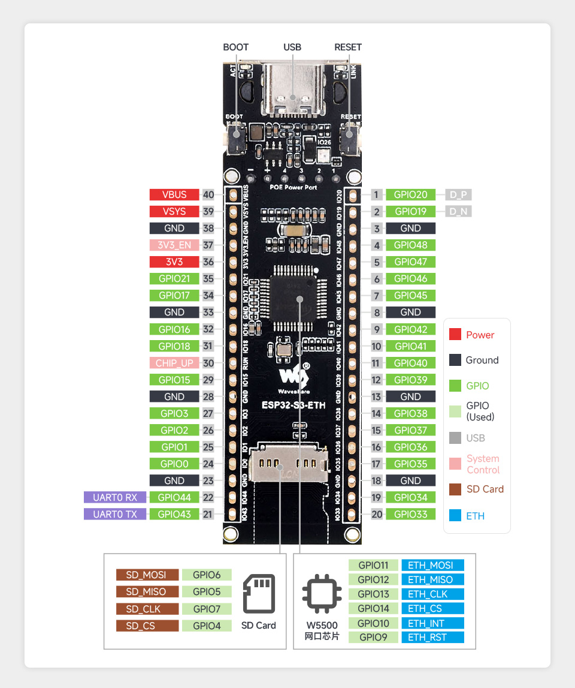

# ESP32-S3-ETH iperf Benchmark Station

ESP-IDF firmware for the [Waveshare ESP32-S3-ETH](https://www.waveshare.com/wiki/ESP32-S3-ETH) board (ESP32-S3 + W5500 SPI Ethernet) that turns it into a plug-in network benchmark target.

## Features

- **iperf3 server** — always-on on port 5201, compatible with `iperf3 -c <ip>`
- **iperf2 server/client** — full `iperf` command on the serial console (TCP + UDP, reverse mode)
- **WiFi captive portal** — open AP `ESP32-ETH-Setup` on boot, configure static IP or DHCP via browser at `http://192.168.4.1`
- **Static IP persistence** — settings stored in NVS, survive reboots
- **1.3" OLED display** — shows Ethernet IP and live iperf3 status/throughput

## Hardware



| Board | Waveshare ESP32-S3-ETH |
|-------|------------------------|
| SoC | ESP32-S3 (dual-core, 240 MHz) |
| Ethernet | W5500 via SPI2 @ 25 MHz |
| Flash | 16 MB |
| PSRAM | 8 MB |

### W5500 SPI Pinout

| Signal | GPIO |
|--------|------|
| SCLK   | 13   |
| MOSI   | 11   |
| MISO   | 12   |
| CS     | 14   |
| INT    | 10   |
| RST    | 9    |

### OLED Display (SH1106 1.3", I2C)

| Signal | GPIO |
|--------|------|
| SDA    | 16   |
| SCL    | 17   |

I2C address auto-detected (0x3C or 0x3D). Display shows Ethernet IP and iperf3 status.

## Requirements

- [ESP-IDF v5.5.4](https://docs.espressif.com/projects/esp-idf/en/v5.5.4/)
- `iperf3` on the client machine (`apt install iperf3` / `brew install iperf3`)

## Build & Flash

```bash
# Load ESP-IDF environment
. ~/esp/esp-idf/export.sh

# First-time: set target and build
rm -rf build sdkconfig
idf.py set-target esp32s3
idf.py build

# Flash (Linux/WSL)
idf.py -p /dev/ttyUSB0 flash

# Monitor
idf.py -p /dev/ttyUSB0 monitor
```

> **WSL2 note:** WSL2 cannot configure `ttyS*` serial ports. Use Windows Python to flash:
> ```bat
> cd build
> python -m esptool --chip esp32s3 -p COM3 -b 460800 --before default_reset --after hard_reset write_flash @flash_args
> ```

## Usage

On first boot the device requests a DHCP address and prints it on the serial console. The iperf3 server starts automatically.

### iperf3 (from client)

```bash
iperf3 -c <device-ip>           # single stream
iperf3 -c <device-ip> -P2       # 2 parallel streams
iperf3 -c <device-ip> -t 30     # 30-second test
```

### iperf2 (serial console commands)

```
iperf -s -i 3                   # TCP server
iperf -u -s -i 3                # UDP server
iperf -c <ip> -t 30 -i 3        # TCP client
iperf -u -c <ip> -b 100M -t 30  # UDP client
iperf --help                    # all options
```

### IP configuration

Connect to WiFi AP **`ESP32-ETH-Setup`** (open, no password) and open `http://192.168.4.1` to switch between DHCP and static IP. The device restarts and applies the new config.

### Other console commands

```
iperf3 -s      # restart iperf3 server if stopped
restart        # reboot
tasks          # FreeRTOS task stats
help           # all commands
```

## Performance

Throughput is limited by the W5500's SPI interface at 25 MHz:

| Test | Throughput |
|------|-----------|
| `iperf3 -c <ip>` | ~4 Mbit/s |
| `iperf3 -c <ip> -P2` | ~7–9 Mbit/s |
| `iperf3 -c <ip> -P4` | ~8–9 Mbit/s |

The W5500 has a 16 KB per-socket RX buffer; with 4 parallel streams TCP congestion windows shrink on the weaker streams.

## Housing

A 3D-printable enclosure for the board + 1.3" OLED display is designed in Fusion 360.

| File | Description |
|------|-------------|
| `housing_fusion.py` | Fusion 360 Python API script — generates parametric body + lid components |
| `housing.scad` | OpenSCAD version of the same geometry |

### Design overview

- **Body**: shell with 2 mm walls, 1.5 mm floor; RJ45 and USB-C cutouts on the front face; 4 standoff posts (3.5 mm) for the PCB; two guide rails to seat the board
- **Lid**: top plate (3 mm) with press-fit rim (5 mm), screen window cutout for the OLED, and 4 display mounting posts with M3 pilot holes (1.25 mm radius)

To run the script: open Fusion 360 → **Tools → Add-Ins → Scripts** → add `housing_fusion.py` → Run in a *New Design* (not a Part Design).

> **Status:** Work in progress — dimensions still being dialled in. STEP export, print-ready STLs, and a rendered image will be added once the fit is confirmed.

## Project Structure

```
main/
  main.c            — app entry, Ethernet init, console setup
  iperf3_server.c   — iperf3 wire protocol implementation (TCP receive)
  wifi_config.c     — WiFi AP + captive portal + NVS IP config
  oled.c / oled.h   — SH1106 I2C OLED driver (128×64, built-in font)
sdkconfig.defaults          — W5500 SPI pin config, Ethernet settings
sdkconfig.defaults.esp32s3  — dual-core, IRAM, 240 MHz, watchdogs off
main/idf_component.yml      — dependencies: ethernet_init, iperf-cmd, cmd_system
```

## License

This project is released under the MIT License.
